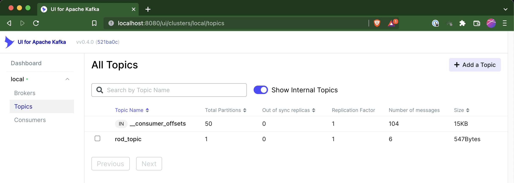

# kafka-example-scala
Sample scala app producing and consuming from kafka.

We are using 3 containers:
- zookeeper
- kafka
- kafka-ui

#### 1- Start the containers:
`make start`

#### 2- Check the kafka-ui is running, and create a topic (`rod_test`):
- http://localhost:8000

#### 3- Run the app from the debugger or use the CLI:
- `mvn scala:compile`
- `mvn scala:run -DmainClass=example.KafkaExampleProducer`
- `mvn scala:run -DmainClass=example.KafkaExampleConsumer`
